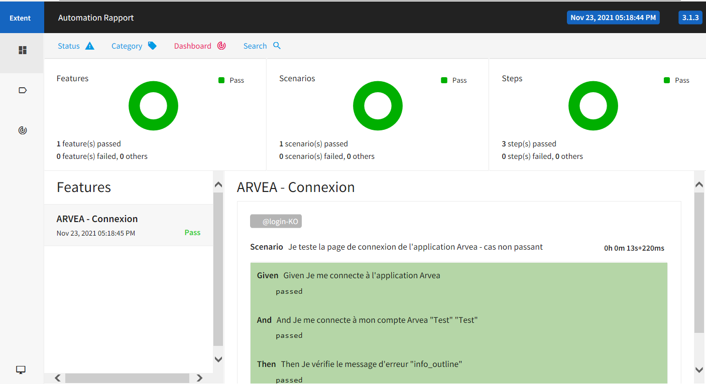

# Selenium - Cucumber Automatisation de test

Selenium-Cucumber est une approche de développement piloté par le comportement (Behavior-Driven Development BDD) pour écrire un script de test d'automatisation pour tester une application Web. 
Il vous permet d'écrire et d'exécuter des tests d'acceptation / unitaires automatisés. Il est multiplateforme, open source et gratuit. Automatisez vos cas de test avec un codage minimal. Vous trouver ci dessous les étapes à suivre afin d'installer la solution d'automatisation de test "frw-automated-test" sur l'environnement windows.

# Documentation

- [ Document technique ](https://maisonduweb.atlassian.net/wiki/spaces/TEST/pages/894501225/Document+technique+globale)
     - Installation
     - Etapes prédéfinies

# Technologies et Environments 

- Selenium WebDriver Version 4
- Cucumber Version 1.2.4
- Junit Version 4
- ExtentReport Version 3.1.3
- Eclipse 2019-12
- JDK Version 14

# Installation (pré-requis)

- JDK 14 (assurez-vous que le chemin d'accès aux classes Java est défini)
- Maven (assurez-vous que le chemin de classe .m2 est défini)
- Eclipse
- Eclipse Plugins pour
    - Maven
    - Cucumber
- Driver du navigateur (assurez-vous que le driver de navigateur souhaité et le chemin de classe sont définis)

# Installation JDK

- Allez sur le site [oracle](https://www.oracle.com/java/technologies/javase-downloads.html) Cliquez sur Télécharger JDK
- Acceptez le Contrat de License
- Téléchargez Java JDK pour votre version (32 ou 64 bits) de java pour Windows
- Une fois le téléchargement terminé, exécutez l'exe pour installer JDK. Cliquez sur Suivant
- Sélectionnez l'installation PATH pour Java et cliquez sur Suivant
- Une fois l'installation terminée, cliquez sur Fermer
- Définir les variables d'environnement

# Installation Eclipse

- Téléchargez l'installateur Eclipse [Download eclipse](https://www.eclipse.org/downloads/)
- Démarrez l'exécutable du programme d'installation Eclipse
- Sélectionnez le package à installer: Choisir Eclipse IDE for Java developers
- Sélectionnez votre dossier d'installation
- Lancez Eclipse

# Importation du framework 

- Télécharger la solution depuis le dépôt Github « frw-automated-test »
- Ouvrir Eclipse 
- Cliquer sur File
- Cliquer sur Importer
- Choisir Maven : Existing Maven Projects
- Cliquer sur Browser
- Choisir le Projet frw-automated-test

# Installation plugin Cucumber

- Ouvrir Eclipse
- Cliquer sur Help
- Cliquer Install New Software
- Cliquer sur le bouton " Add"
- Taper le nom comme vous le souhaitez, exemple " Cucumber " et taper " http://cucumber.github.com/cucumber-eclipse/update-site " comme emplacement. Cliquer OK
- Cochez la case ok et appuyez sur le bouton " Suivant "
- Cliquer sur “I accept the terms of the license agreement” puis cliquer sur Terminer
- Vous pouvez ou non rencontrer un avertissement de sécurité, si vous cliquez simplement sur OK
- Redémarrer Eclipse.

# Installation de TestNG dans Eclipse
- Ouvrir Eclipse
- Cliquer sur Help
- Cliquer Install New Software
- Cliquer sur le bouton " Add"
- Saisir "http://dl.bintray.com/testng-team/testng-eclipse-release/" dans la zone Work wit
- Saisir "TestNG" dans le champ de texte du Nam
- Cliquer sur le bouton Add
- Cocher la case "TestNG"
- Cliquer sur le bouton "Next"
- Sélectionner le bouton radio " I accept the terms of the license agreement"
- Cliquer sur Finish
- Cliquer sur "Install anyway"
- Cliquer sur " Restart now".

# Installation du fichier ChromeDriver.exe

- Aller dans le site [Download ChromeDriver](https://chromedriver.chromium.org/downloads)
- Télécharger le fichier chromeDriver.exe compatible avec la version du navigateur
- Créer un package executableDrivers sous la source folder src/test/ressources
- Copier-coller du fichier chromeDriver.exe dans le dossier src/test/ressources  / executableDrive
- Mettre le path du fichier chromeDriver.exe dans la classe src/test/java / package util / class ChromeDriverManager.java / (new File("path/chromedriver.exe"))

# Fichier de configuration 

Emplacement : src/test/resources/testData
configFile
Le fichier de configuration de l’url de l’environnement de test, adresses et mots de passe de test se trouve sous src/test/resources/testData
-	Dupliquer le fichier configFile-exemple.json 
-	Nommer le fichier configFile.json
-	Mettre à jour l’URL pour l’environnement à tester
-	Mettre l’URL, les Adresses et les mots de passe du fichier configFile.json
 
#  Où sont écrits les tests ?

Les tests sont écrits dans le repertoire src/spec/feature avec le syntaxe Gherkin
- Gherkin utilise un ensemble de mots clés spéciaux pour donner une structure et un sens aux spécifications exécutables. Gherkin permet d’écrire des scénarios de test compréhensibles par des individus non techniques. Cette approche sert deux objectifs : documenter les fonctionnalités à développer d’une part, et permettre l’automatisation des tests d’autre part.La plupart des lignes d'un document Gherkin commencent par l'un des mots clés:
  - Le “Given” mot-clé précède le texte définissant le contexte; l'état connu du système (ou condition préalable).
  - Le “When” mot-clé précède le texte définissant une action.
  - Le “Then” mot-clé précède le texte définissant le résultat de l'action sur le contexte (ou résultat attendu).
  
# Exécution des tests avec la classe d'exécution
 
La classe d'exécution de test est l'un des nombreux mécanismes à l'aide desquels vous pouvez exécuter le fichier de fonctionnalité Cucumber. 
La classe d’exécution est sous src/test/java / TestRunnerCucumber.java

- Pour exécuter les cas de test :
  - Choisir les tags à exécuter dans la source folder src/spec/feautures
  - Cliquer bouton droit sur la classe TestRunnerCucumber.java
  - Choisir Run As
  - Cliquer sur Junit Test

# Exécution des tests avec l'invite de commande

- Pré-requises 
   -	Télécharger Apache Maven .rar
   -	Dézipper le fichier Apache maven
   -	Mettre le fichier apache dans Variable d’environnement  
- Exécutez la commande suivante dans l'invite de commande
   -	mvn test

# Reporting 

Les résultats de test s’affichent dans un rapport Extent nommé Arvea.html dans le dossier Target / Cucumber-reports

# Synthèse Framework de test auto en BDD

- Approche agile
  - Approche BDD 
- Technologies
  - Cucumber 
    - [Cucumber-JVM pour le BDD](https://cucumber.io/docs/installation/java/#maven)
  - Webdriver pour les UI 
    - [La lib officielle / Selenium (en Java)](https://mvnrepository.com/artifact/org.seleniumhq.selenium/selenium-java)
  - Assertion 
    - [Assert (JUnit API)](http://junit.sourceforge.net/javadoc/org/junit/Assert.html)
  - Report 
    - [Extent report](https://extentreports.com/)
  - Runtime 
    - [JUnit](http://junit.sourceforge.net/javadoc/org/junit/Assert.html)
  - Langage de Scripting
      - JAVA
- Architecture / Structure
  - POM (Page Object Model)
  - features
  - stepDefinitions
  - pageObjects
  - reports

